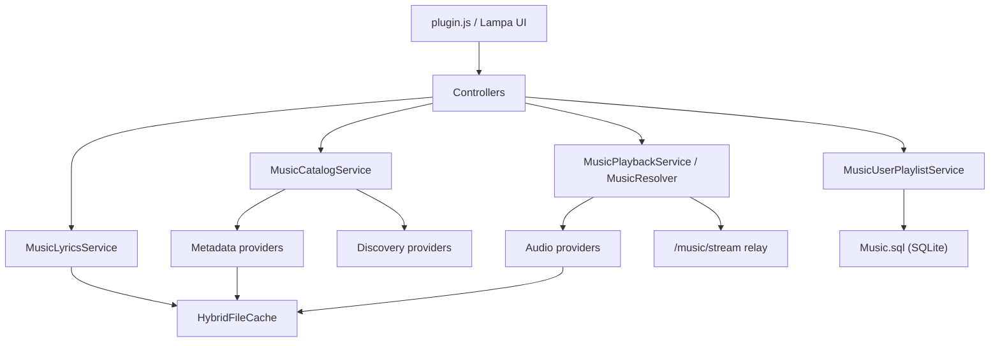

# Music

Музыкальный модуль для [Lampac] — превращает Lampa в полноценный музыкальный сервис: главный экран с полками и чартами, поиск, экраны артистов и альбомов, пользовательские плейлисты, импорт из Spotify / Apple Music / SoundCloud, синхронизированные тексты песен и воспроизведение с поддержкой lock screen на iOS.

Модуль серверный (C# / ASP.NET, динамическая компиляция при старте Lampac) с единым клиентом для Lampa ([plugin.js](./plugin.js)), который отдаётся как `/music.js`.


## Возможности

- **Главный экран** — недавно прослушанное, недавние альбомы/артисты/поиски, пользовательские плейлисты и discovery-полки (чарты Apple Music, VK Top, подборки SoundCloud).
- **Поиск** — артисты, альбомы, треки; каноническая база метаданных MusicBrainz, дополнительные секции из YouTube Music.
- **Воспроизведение** — автоматический подбор playable-источника (YouTube, Sefon, SoundCloud, опционально Z3Fm) с ручным переопределением: выбранный вручную источник закрепляется (`pinned`) и переживает перезапуски.
- **Пользовательские плейлисты** — создание, наполнение из любого экрана, перестановка треков, хранение на сервере с привязкой к профилю браузера.
- **Импорт плейлистов и альбомов по ссылке** — Spotify, Apple Music, SoundCloud; без API-ключей и без логина. Повторная синхронизация — слияние: локальный порядок и ручные правки сохраняются, новые треки источника добавляются в начало.
- **Управление очередью отовсюду** — лонг-тап по треку в любом списке: «Играть следующим», «Добавить в очередь», «Убрать из очереди»; перестановка и удаление также из шита очереди плеера. Очередь переживает перезапуск клиента (снапшот с восстановлением позиции).
- **Радио** — «Радио от трека» из меню любого трека (волна от выбранной песни) и автоподборка в конец очереди; движок похожести — рекомендации SoundCloud (related/station) со слоистым пулом и жёстким дедупом.
- **Статистика прослушиваний** — «Твой топ»: играбельный альбом из самых прослушиваемых треков, появляется после накопления данных; счётчики по дням в SQLite.
- **Выбор плеера для музыки** — отдельная настройка в «Настройки → Плеер», независимая от глобального плеера Lampa (встроенный, iOS, VLC и другие внешние).
- **Тексты песен** — синхронизированная (караоке) и обычная лирика через lrclib с фоллбеком на YouTube Music.
- **iOS lock screen** — в standalone-режиме плеера: play/pause, next/prev, перемотка скраббером, корректные метаданные и обложка, автопереход треков, устойчивое возобновление на заблокированном экране.
- **Стриминг через сервер** — клиент никогда не ходит на внешние CDN напрямую: единый relay `/music/stream` с поддержкой Range-запросов, тикетами и автоматическим повторным резолвом протухших ссылок.

## Архитектура

Модуль не пытается сделать «универсальный парсер любого сайта». Каждый внешний источник подключается в одной или нескольких строго разделённых ролях:

| Роль | Ответственность | Текущие источники |
| --- | --- | --- |
| **Metadata** | канонические артисты, альбомы, треки | MusicBrainz |
| **Discovery** | полки, чарты, подборки, секции поиска | Apple Music, VK Top, SoundCloud, YouTube Music |
| **Audio** | playable match и stream sources | YouTube (основной), Sefon, SoundCloud, Z3Fm (опц.) |
| **Auth** | внешние пользовательские аккаунты | SoundCloud (каркас, выключен по умолчанию) |
| **Images** | обогащение картинок | Discogs (фото артистов) |
| **Import** | импорт плейлистов по ссылке | Spotify, Apple Music, SoundCloud |

Ключевые принципы:

- **Metadata-база одна** — MusicBrainz. Discovery- и audio-источники не становятся источником правды о каталоге.
- **Home всегда быстрый** — discovery-провайдеры опрашиваются параллельно с бюджетом времени; медленный или упавший источник не блокирует ответ, его секция догревается в фоне.
- **Durable отделён от volatile** — SQLite хранит только результат действий пользователя (история, плейлисты, pinned-источники, учётные данные); все кэши живут в `HybridFileCache` и памяти.



### Структура каталога

```
Controllers/        HTTP API: ApiController, SearchController, PlaybackController, AuthController
Models/             Contracts.cs — DTO контрактов API
Providers/
  Abstractions/     интерфейсы провайдеров
  Metadata/         MusicBrainz
  Discovery/        AppleMusic, VkTopChart, SoundCloud, YouTubeMusic
  Audio/            YouTube, Sefon, Z3Fm
  SoundCloud/       общий site-support (partial: Catalog / Audio / Import / Auth)
  Spotify/          импорт публичных плейлистов/альбомов (анонимный embed-токен)
  AppleMusic/       импорт публичных плейлистов/альбомов (анонимный web-JWT)
Services/
  Catalog/          оркестрация home / search / секций, реестр провайдеров
  Playback/         резолвер источников, stream relay, тикеты, история
  Playlists/        пользовательские и импортированные плейлисты
  Lyrics/           lrclib + YouTube Music fallback
  Images/           image proxy, Discogs
  Cache/            metadata cache, source-match cache
SQL/                MusicContext.cs — durable SQLite с self-healing и safe backup
plugin.js           весь клиент Lampa, отдаётся как /music.js
ModInit.cs          регистрация модуля и значения конфигурации по умолчанию
ModuleConf.cs       схема настроек
manifest.json       dynamic: true, зависимость YoutubeExplode
```

## Установка

1. Поместите каталог `Music` в `Modules/` вашей установки Lampac. Модуль объявлен как `dynamic` и компилируется автоматически при старте.
2. Перезапустите Lampac. При первом старте создаётся `database/music/` с SQLite-базой.
3. Клиентский плагин доступен по адресу `{host}/music.js` — подключите его в Lampa штатным способом (`initPlugins` в конфигурации LampaWeb либо вручную как плагин).

Проверка, что сервер поднялся:

```bash
curl -fsS 'http://127.0.0.1:9118/music/home'
curl -fsS 'http://127.0.0.1:9118/music/providers'
```

## Конфигурация

Настройки задаются в `init.conf` Lampac под ключом `Music` и подхватываются без перезапуска. Пример:

```jsonc
{
  "Music": {
    "soundcloud_country": "DE",
    "z3fm_enabled": true,
    "z3fm_audio_enabled": true
  }
}
```

Полная схема ([ModuleConf.cs](./ModuleConf.cs)) со значениями по умолчанию ([ModInit.cs](./ModInit.cs)):

| Параметр | По умолчанию | Описание |
| --- | --- | --- |
| `default_metadata_provider` | `musicbrainz` | metadata-база каталога |
| `default_audio_provider` | `youtubeaudio` | основной audio-провайдер |
| `default_auth_provider` | *(пусто)* | auth-провайдер по умолчанию |
| `client_debug_enabled` | `false` | приём клиентских трейсов на `/music/clientlog` (только для отладки) |
| `youtube_audio_enabled` | `true` | YouTube как audio-источник (через YoutubeExplode) |
| `sefon_audio_enabled` | `true` | Sefon как дополнительный audio-источник |
| `soundcloud_enabled` | `true` | SoundCloud целиком |
| `soundcloud_discovery_enabled` | `true` | полки/подборки SoundCloud |
| `soundcloud_audio_enabled` | `true` | SoundCloud как audio-источник |
| `soundcloud_auth_enabled` | `false` | вход в аккаунт SoundCloud (OAuth) |
| `soundcloud_client_id` | *(пусто)* | собственный client_id; без него скрапится публичный |
| `soundcloud_client_secret` | *(пусто)* | для OAuth-потока |
| `soundcloud_redirect_uri` | *(пусто)* | для OAuth-потока |
| `soundcloud_country` | `US` | регион чартов/подборок |
| `z3fm_enabled` | `false` | Z3Fm целиком (требует Playwright для антибота) |
| `z3fm_audio_enabled` | `false` | Z3Fm как audio-источник |
| `z3fm_proxy_enabled` / `z3fm_proxy_url` / `z3fm_proxy_username` / `z3fm_proxy_password` | `false` / *(пусто)* | прокси для Z3Fm |
| `limit_map` | `^/music`: 15 req/s | WAF rate-limit для эндпоинтов модуля |

## HTTP API

Все эндпоинты живут под префиксом `/music`. Внешние картинки в ответах проксируются через image-proxy, stream-ссылки — через relay: клиенту не нужны прямые запросы к внешним сервисам.

### Клиент и служебные

| Метод | Эндпоинт | Назначение |
| --- | --- | --- |
| GET | `/music.js`, `/music/js/{token}` | клиентский плагин |
| GET | `/music/providers` | список активных провайдеров |
| POST | `/music/clientlog` | приём клиентских трейсов (при `client_debug_enabled`) |

### Каталог и поиск

| Метод | Эндпоинт | Назначение |
| --- | --- | --- |
| GET | `/music`, `/music/home` | главный экран |
| GET | `/music/section?id=` | полный список секции («Ещё» / пагинация) |
| GET | `/music/search?q=` | поиск |
| GET | `/music/artist?id=` | экран артиста |
| GET | `/music/artistsection` | догрузка секций артиста |
| GET | `/music/artistimg` | lazy-обогащение фото артиста (Discogs) |
| GET | `/music/album?id=` | экран альбома |
| GET | `/music/track` | данные трека |

### Воспроизведение

| Метод | Эндпоинт | Назначение |
| --- | --- | --- |
| GET | `/music/play` | playable-ответ для трека (источники + stream URL) |
| GET | `/music/stream` | relay стрима (Range, тикеты, авто re-resolve) |
| GET | `/music/matches` | кандидаты audio-источников для трека |
| POST | `/music/match/select` | закрепить ручной выбор источника (`pinned`) |
| POST | `/music/match/reset` | сбросить закреплённый выбор |
| GET | `/music/playlist.m3u` | плейлист очереди в формате M3U |
| POST | `/music/history/mark` | обновить историю; `count_play=true` дополнительно инкрементит статистику (только честный play-путь) |
| POST | `/music/history/remove` | удалить запись истории |
| GET | `/music/stats/top` | топ треков профиля + условия разблокировки «Твоего топа» |

### Плейлисты

| Метод | Эндпоинт | Назначение |
| --- | --- | --- |
| GET | `/music/playlists` | список плейлистов профиля |
| GET | `/music/playlists/tracks` | треки плейлиста |
| POST | `/music/playlists/create` | создать плейлист |
| POST | `/music/playlists/delete` | удалить плейлист |
| POST | `/music/playlists/import` | импорт по ссылке (Spotify / Apple Music / SoundCloud) |
| POST | `/music/playlists/sync` | пересинхронизировать импортированный плейлист |
| POST | `/music/playlists/track/add` | добавить трек |
| POST | `/music/playlists/track/remove` | убрать трек |
| POST | `/music/playlists/track/move` | переставить трек внутри плейлиста (`position` — финальный индекс) |
| POST | `/music/radio` | подобрать похожие треки (автоподборка очереди и «Радио от трека») |

### Прочее

| Метод | Эндпоинт | Назначение |
| --- | --- | --- |
| GET | `/music/lyrics` | текст песни (synced/plain) |
| GET | `/music/auth/state` | состояние внешней авторизации |
| POST | `/music/auth/save` | сохранить учётные данные |
| POST | `/music/auth/logout` | выйти |

## Как это работает

### Резолв и воспроизведение трека

1. Клиент вызывает `/music/play` с идентификатором трека и fallback-параметрами (артист, название, длительность).
2. [MusicPlaybackService](./Services/Playback/MusicPlaybackService.cs) собирает track DTO, [MusicResolver](./Services/Playback/MusicResolver.cs) подбирает audio match: сначала закреплённый пользователем `pinned`-источник, затем кэшированный авто-матч, затем поиск по провайдерам с ранжированием.
3. Выбранный провайдер возвращает stream sources; сервер превращает их в тикетные URL `/music/stream?...` — прямые ссылки на CDN клиенту не отдаются.
4. Relay отдаёт поток с поддержкой Range. Если тикет жив, а upstream-ссылка умерла (403/404/410), выполняется прозрачный повторный резолв по fallback-параметрам — трек не прерывается ни при протухании ссылки, ни после перезапуска сервера.

Ручной выбор источника («Источники» в интерфейсе, включая поиск произвольным запросом) сохраняется как `pinned` в SQLite и имеет безусловный приоритет над эвристиками — это спасает треки с «грязными» метаданными из чартов.

### Режимы плеера

У клиента две принципиально разные реальности воспроизведения:

- **`inner`** — встроенный плеер Lampa. На iOS lock screen поддерживает play/pause, next/prev, метаданные и обложку; перемотка скраббером в этом режиме сознательно не поддерживается (подробный разбор: [docs/ios-embedded-lockscreen-seek.md](./docs/ios-embedded-lockscreen-seek.md)).
- **`ios`** — standalone audio-плеер модуля для iPhone: собственный полноэкранный интерфейс (очередь, shuffle/repeat, таймер сна, лирика, свайпы), полный Media Session (включая скраббер перемотки), keep-alive аудиосессии и восстановление воспроизведения на заблокированном экране.

Эти режимы не следует смешивать — у них разная логика Media Session и жизненного цикла audio-элемента.

### Плейлисты и импорт

Плейлисты хранятся на сервере (SQLite, таблица `user_playlists`) с привязкой к профилю браузера — той же identity, что и история прослушиваний. Payload плейлиста содержит полные объекты треков, поэтому плейлист самодостаточен и не зависит от доступности внешних каталогов.

Импорт по ссылке работает без ключей и логина:

- **Spotify** — анонимный токен со страницы embed-плеера + внутренний GraphQL API с пагинацией; импорт атомарный (сбой любой страницы отменяет импорт целиком).
- **Apple Music** — анонимный developer-JWT из веб-бандла music.apple.com + публичный catalog API; поддержаны плейлисты (включая пользовательские `pl.u-…`) и альбомы, все storefront'ы.
- **SoundCloud** — публичный client_id (скрапится автоматически либо задаётся в конфиге).

Импортированный плейлист хранит `source` и может быть пересинхронизирован. Синхронизация зеркалит источник: ручные изменения в таком плейлисте будут перезаписаны.

### Тексты песен

`/music/lyrics` возвращает синхронизированный (LRC, построчный тайминг) или обычный текст. Основной источник — [lrclib.net](https://lrclib.net); при отсутствии synced-варианта пробуется fallback через YouTube Music. Кэширование дифференцированное: synced-результаты живут долго, plain-only и «не найдено» — коротко, сетевые сбои не кэшируются вовсе и помечаются `retry` для клиента.

### Радио

У радио два входа:

- **«Радио от трека»** — пункт в лонг-тап меню любого трека: выбранный трек стартует первым, дальше — волна из ~20 подобранных. При неудаче подбора текущая очередь не меняется.
- **Автоподборка** — opt-in тумблер («Автоподборка треков» в фильтре и чип «Подборка» в фулл-плеере — одна настройка, выключена по умолчанию): когда очередь подходит к концу, в неё догружаются похожие треки. В шите очереди граница отмечается разделителем «Дальше автоподборка».

Движок похожести — слоистый пул на сервере (`MusicRadioService`):

1. **Рекомендации SoundCloud по треку** — `related` и `track-station` (их коллаборативная фильтрация), основной слой;
2. **Топ-треки сид-артистов** (YouTube Music / SoundCloud поиск) — только backfill при недоборе.

Пулы чередуются round-robin, чтобы выдача не вырождалась в одного исполнителя.

Контракт:

- работает только для управляемой очереди модуля (`ios` / `inner`), не для внешних m3u-плееров;
- `POST /music/radio` принимает seed-треки и явный `exclude` текущей очереди; сиды всегда исключаются из выдачи;
- дедуп: `track.id`, нормализованные `artist + title`, история прослушиваний за сутки;
- шумофильтр: миксы/подкасты/реакции, треки короче 45с и длиннее 12мин; cover/karaoke/sped up/slowed/nightcore/remix — только если этих слов не было в сиде; при полностью кириллическом сид-контексте латинский мусор отсекается;
- триггер автоподборки — предпоследний трек по порядку воспроизведения (с учётом shuffle), не чаще одного запроса на поколение очереди;
- `repeat=all` отключает автоподборку: зацикленная очередь — осознанный выбор;
- если кандидатов мало, сервер честно отвечает `available:false` и клиент ничего не добавляет.

Главный риск фичи — не код, а качество рекомендаций; настройка ведётся по живым промахам, не «по формуле». SponsorBlock для YouTube-треков сознательно не в roadmap (нет реальной боли, внешний skip-сервис рискует ложными пропусками); YouTube Mix как движок рекомендаций проверен и отвергнут — анонимный доступ закрыт YouTube («Войдите в аккаунт»), логин-пути модуль не использует.

### Статистика: «Твой топ»

Статистика подаётся не экраном с цифрами, а **играбельным альбомом**: карточка «Твой топ» появляется на главном экране рядом с плейлистами только после накопления данных (10 разных треков и либо фаворит с 10 прослушиваниями, либо 100 прослушиваний суммарно). Внутри — топ треков с настоящими «Слушать»/«Перемешать», числом прослушиваний у каждой строки и сухой метой в духе «247 прослушиваний · примерно 18 ч · артисты заработали ≈ $0.99 · почти кофе».

Данные: таблица `track_stats_daily` (профиль, трек, день, счётчики, `last_played`) — только счётчики, витрина треков джойнится из `playback_history`. Инкремент происходит исключительно на честном play-пути (`count_play=true` после реальной задержки воспроизведения) — обновления payload статистику не трогают. Дневная гранулярность оставляет пространство для будущих окон («за месяц», «На повторе», «Вернуть в ротацию»).

### Хранение данных

**Durable (SQLite, `database/music/Music.sql`)** — только то, что выражает действие пользователя или долгоживущую identity: история прослушиваний, дневная статистика (`track_stats_daily`), пользовательские плейлисты, pinned-выборы источников, учётные данные внешних сервисов. База защищена self-healing (карантин повреждённого файла вместе с WAL/SHM-сайдкарами, восстановление из последнего валидного бэкапа) и безопасным бэкапом через SQLite backup API.

**Volatile (`HybridFileCache` + память)** — кэши метаданных, авто-матчей, лирики, картинок, stream-тикеты. Волатильный кэш никогда не попадает в SQLite.

## Расширение: новый источник

Источник подключается не «сайтом целиком», а конкретной ролью. Рекомендуемый порядок внедрения незнакомого сервиса: **Discovery → Audio → Auth** — сначала источник безопасно появляется в интерфейсе, затем добавляется воспроизведение.

Общий порядок:

1. Определить, что источник реально даёт (полки? стримы? аккаунт?).
2. Реализовать провайдер под соответствующий интерфейс из [Providers/Abstractions](./Providers/Abstractions).
3. Добавить флаги в [ModuleConf.cs](./ModuleConf.cs) и значения по умолчанию в [ModInit.cs](./ModInit.cs) (для audio-источников default — `false`, пока не проверено качество матчей).
4. Зарегистрировать провайдер в [MusicProviderRegistry.cs](./Services/Catalog/MusicProviderRegistry.cs).
5. Проверить через API, не трогая остальную архитектуру.

### Контракты по ролям

**Discovery** (`IMusicDiscoveryProvider`): `GetHomeSectionsAsync` — короткие секции для home, `GetSectionAsync` — полный список для «Ещё»/пагинации.

**Audio** (`IMusicAudioProvider`): `SearchAsync` — кандидаты `MusicAudioMatch` по `MusicTrack`; `GetStreamsAsync` — playable `MusicPlaybackSource`; `GetPreferredStreamAsync` — быстрый exact-id путь, если он есть, иначе `null`.

Проверка:

```bash
curl -fsS 'http://127.0.0.1:9118/music/home'
curl -fsS 'http://127.0.0.1:9118/music/section?id=examplemusic:top'
curl -fsS 'http://127.0.0.1:9118/music/matches?title=Song&artist_name=Artist&audio_provider=examplemusicaudio'
```

### Обязательные требования к провайдерам

- Не делать новый источник metadata-базой без отдельного архитектурного решения.
- Не блокировать `/music/home` долгими запросами — уважать бюджет времени.
- Не кэшировать сетевой сбой как «пусто навсегда»; пустые результаты кэшировать только коротко.
- Stream отдавать через `/music/stream`, а не напрямую клиенту.
- Уважать `pinned`-выбор пользователя.
- Внешние картинки возвращать в обычных полях ответа, чтобы их подхватил `MusicImageProxyService`.

## Разработка

После изменения серверного кода — пересборка (модуль компилируется при старте контейнера):

```bash
docker compose up -d --build lampac
```

После изменения только `plugin.js` пересборка не нужна (файл монтируется), но клиент Lampa кэширует плагин — нужно поднять revision в конфигурации подключения плагина и полностью перезапустить клиент.

Smoke-проверка:

```bash
curl -fsS 'http://127.0.0.1:9118/music/home'
curl -fsS 'http://127.0.0.1:9118/music/search?q=nirvana'
curl -fsS 'http://127.0.0.1:9118/music/providers'
```

Клиентская отладка: включить `client_debug_enabled`, трейсы клиента будут приходить на `/music/clientlog` и попадать в логи сервера. После отладки — выключить.

## Известные ограничения

- Импорт Spotify / Apple Music и авто-получение SoundCloud client_id опираются на недокументированные публичные механизмы этих сервисов; при изменениях на их стороне импорт может временно ломаться до обновления модуля (симптом для Spotify — `PersistedQueryNotFound` в логах).
- Перемотка скраббером на iOS lock screen поддерживается только в standalone-режиме плеера (`ios`), не во встроенном (`inner`).
- Синхронизация импортированного плейлиста — недеструктивное слияние: порядок и ручные правки сохраняются, новинки добавляются в начало; но треки, удалённые в источнике, локально не удаляются (убрать можно только вручную).
- Управление очередью (играть следующим, убрать, радио-догрузка) работает только для управляемой очереди модуля (`ios` / `inner`); внешние плееры получают разовый плейлист без возможности менять его после запуска.
- Статистика накапливается с момента включения фичи: прослушивания до неё известны только как «последний раз слушал», без счётчиков.
- Лайки/библиотека внешних сервисов переносятся через публичный плейлист (скопировать Liked Songs в публичный плейлист и импортировать по ссылке); прямой доступ к библиотеке требует логина и не реализован.
