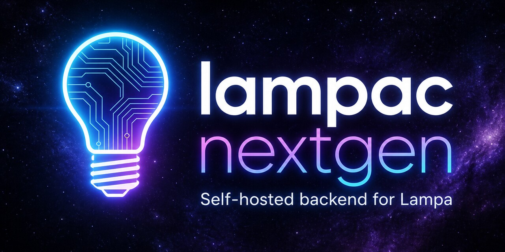

# Lampac Next Generation



[](https://github.com/lampac-nextgen/lampac/actions/workflows/build.yml)
[](https://github.com/lampac-nextgen/lampac/actions/workflows/test-build.yml)
[](https://github.com/lampac-nextgen/lampac/actions/workflows/release.yml)
[](https://github.com/lampac-nextgen/lampac/actions/workflows/format-code.yml)

[](https://github.com/lampac-nextgen/lampac/releases)
[](https://github.com/lampac-nextgen/lampac/tags)
[](LICENSE)
[](https://dotnet.microsoft.com/)
[](https://github.com/lampac-nextgen/lampac/pkgs/container/lampac)
[](https://github.com/lampac-nextgen/lampac/stargazers)
[](https://github.com/lampac-nextgen/lampac/forks)
[](https://github.com/lampac-nextgen/lampac/commits/main)
[](https://github.com/lampac-nextgen/lampac/issues)

[](https://docs.lampac.dev)
[](https://docs.lampac.dev)
[](https://t.me/LampacTalks/13998)
[](https://deepwiki.com/lampac-nextgen/lampac)

> Самохостируемый backend-сервер для [Lampa](https://github.com/yumata/lampa). Собирает ссылки на публично доступный контент с 70+ источников и отдаёт их Lampa в виде плагинов. Построен на ASP.NET Core (.NET 10).

Полная документация — [docs.lampac.dev](https://docs.lampac.dev) (установка, модули, API).

---

[Lampa](https://github.com/yumata/lampa) — бесплатное приложение для просмотра информации о фильмах. **Lampac NextGen** расширяет его: собирает ссылки с десятков российских, украинских, аниме- и западных источников, отдаёт в виде JSON API, и дополнительно предоставляет TorrServer, DLNA, транскодинг, синхронизацию закладок и многое другое. Порт по умолчанию — **9118**.

<details>
<summary><strong>Возможности</strong></summary>

- **70+ VOD, аниме и 18+ источников** — провайдеры в `Modules/OnlineRUS`, `OnlinePaid`, `OnlineAnime`, `OnlineENG`, `OnlineUKR`, `OnlineGEO`, `Adult/`
- **TorrServer** — встроенный торрент-сервер как подпроцесс
- **DLNA/UPnP** — медиасервер для локальных файлов
- **JacRed** — агрегатор торрент-индексаторов (совместим с Jackett)
- **GStreamer** — HLS/fMP4 транскодинг (замена legacy Transcoding/FFmpeg), плагин `/gst.js`
- **Transcoding** — legacy транскодинг через FFmpeg (до 5 потоков); предпочтительнее **GStreamer**
- **Tracks** — управление субтитрами и дорожками (FFprobe)
- **Sync** — кросс-девайсная синхронизация закладок и истории (SQLite)
- **TimeCode** — сохранение позиции воспроизведения
- **TmdbProxy** — локальный кеш TMDB API
- **LampaWeb** — хостинг Lampa UI (авто-обновление с GitHub), виджеты Samsung Tizen (`/samsung.wgt`) и LG webOS (`/lg.ipk`)
- **Tg-notify.bot** — Telegram-уведомления о новых сериях и озвучках, плагин `/tg-notify.js`
- **WebLog** — отладка HTTP и Playwright-трафика в реальном времени
- **Playwright** — автоматизация Chromium/Firefox для обхода JS-защит
- **RCH** — WebSocket-реле для клиентов за NAT (`/nws`)
- **WAF** — брандмауэр с геоблокировкой, лимитами и защитой от брутфорса
- **GeoIP** — MaxMind GeoLite2 (базы включены в поставку)
- **Горячая перезагрузка конфига** — `init.conf` применяется без перезапуска
- **Многоплатформенность** — `linux/amd64`, `linux/arm64`

</details>

---

## Содержание

- [Документация](#документация)
- [Быстрый старт](#быстрый-старт)
  - [Docker](#docker)
  - [Нативная установка (Linux)](#нативная-установка-linux)
  - [Нативная установка (Windows)](#нативная-установка-windows)
  - [Ручная сборка](#ручная-сборка)
- [Конфигурация](#конфигурация)
- [Модули](#модули)
- [Провайдеры контента](#провайдеры-контента)
- [API](#api)
- [Архитектура](#архитектура)
- [Зависимости](#зависимости)
- [Структура проекта](#структура-проекта)
- [Дополнительная документация](#дополнительная-документация)

---

## Документация

Пользовательские руководства, модули и API: **[docs.lampac.dev](https://docs.lampac.dev)**.

| Раздел | URL |
| --- | --- |
| Быстрый старт | [docs.lampac.dev/quickstart](https://docs.lampac.dev/quickstart) |
| Установка | [docs.lampac.dev/installation](https://docs.lampac.dev/installation) |
| Конфигурация | [docs.lampac.dev/configuration/overview](https://docs.lampac.dev/configuration/overview) |
| Модули | [docs.lampac.dev/modules/overview](https://docs.lampac.dev/modules/overview) |
| Провайдеры | [docs.lampac.dev/providers/overview](https://docs.lampac.dev/providers/overview) |
| API | [docs.lampac.dev/api/overview](https://docs.lampac.dev/api/overview) |
| Архитектура | [docs.lampac.dev/architecture/overview](https://docs.lampac.dev/architecture/overview) |

---

## Быстрый старт

### Docker

**Основной сценарий** — `docker-compose.yaml`, порт **9118**. Подробнее: [быстрый старт](https://docs.lampac.dev/quickstart) и [Docker](https://docs.lampac.dev/deployment/docker).

```bash
git clone https://github.com/lampac-nextgen/lampac.git
cd lampac

mkdir -p lampac-docker/config lampac-docker/plugins
cp config/example.init.conf lampac-docker/config/init.conf
printf '%s' 'ваш_пароль_root' > lampac-docker/config/passwd

# Раскомментируйте блок volumes в docker-compose.yaml
docker compose up -d
```

По умолчанию все тома закомментированы — контейнер стартует с `init.conf` и `passwd` из образа. Рабочая директория в контейнере — `/lampac`; файлы читаются из её корня, а не из подкаталога `config/`.

Проверка: `curl -fsS "http://localhost:9118/version?type=hash"`. Плагин Lampa: `http://YOUR_IP:9118/online.js`.

<details>
<summary><strong>Тома и сеть</strong></summary>

| Путь на хосте | Путь в контейнере | Назначение |
| --- | --- | --- |
| `./lampac-docker/config/passwd` | `/lampac/passwd` | Пароль root (WebLog, служебные функции) |
| `./lampac-docker/config/init.conf` | `/lampac/init.conf` | Конфигурация |
| `./lampac-docker/plugins/lampainit.js` | `/lampac/plugins/override/lampainit.js` | Переопределение клиентского плагина |
| `./lampac-docker/cache` | `/lampac/cache` | Кеш |
| `./lampac-docker/database` | `/lampac/database` | БД (Sync, TimeCode, SISI) |
| `./lampac-docker/mods/<Name>` | `/lampac/mods/<Name>` | Пользовательские модули |

Сеть по умолчанию — bridge с IP `10.10.10.10`. Для `host`-режима раскомментируйте `network_mode: host` в compose-файле и согласуйте блоки `ports` / `networks`.

Минимальный пример сервиса:

```yaml
services:
  lampac:
    image: ghcr.io/lampac-nextgen/lampac
    ports:
      - "9118:9118"
    shm_size: 1024mb
    restart: unless-stopped
    volumes:
      - ./lampac-docker/config/passwd:/lampac/passwd
      - ./lampac-docker/config/init.conf:/lampac/init.conf
      - ./lampac-docker/plugins/lampainit.js:/lampac/plugins/override/lampainit.js
```

</details>

<details>
<summary><strong>Dev-режим (порт 29118)</strong></summary>

`docker-compose.dev.yaml` — отдельная инстанция на порту **29118** для разработки. Тома включены по умолчанию.

```bash
mkdir -p lampac-docker/config lampac-docker/plugins
cp config/example.init.conf lampac-docker/config/development.init.conf
# В development.init.conf установите: "listen"."port": 29118

printf '%s' 'ваш_пароль_root' > lampac-docker/config/passwd
cp Modules/LampaWeb/plugins/lampainit.js lampac-docker/plugins/lampainit.js

docker compose -f docker-compose.dev.yaml up -d
```

> Оба compose-файла используют `container_name: lampac` — одновременный запуск без правки невозможен.

</details>

<details>
<summary><strong>Управление модулями в Docker</strong></summary>

Состав загружаемых модулей задаётся двумя механизмами:

1. **`BaseModule.SkipModules`** в `init.conf` — имена модулей, которые не загружаются даже если код есть в образе.
2. **`manifest.json`** в каталоге модуля — ключ `"enable": true|false`. Часть модулей ([AdminPanel](Modules/AdminPanel/manifest.json), [ExternalBind](Modules/ExternalBind/manifest.json)) поставляется с `"enable": false`.

Чтобы включить выключенный модуль без пересборки образа: скопируйте его каталог, отредактируйте `manifest.json` и смонтируйте в `/lampac/module/<Name>/` (штатный) или `/lampac/mods/<Name>/` (пользовательский). Каталог модулей: [docs.lampac.dev/modules/overview](https://docs.lampac.dev/modules/overview).

</details>

---

### Нативная установка (Linux)

Поддерживаются Debian/Ubuntu, amd64 и arm64. Скрипт устанавливает .NET 10 runtime, создаёт системного пользователя `lampac` и регистрирует systemd-сервис. Подробнее: [установка](https://docs.lampac.dev/installation) и [Linux](https://docs.lampac.dev/deployment/linux).

```bash
# Установка
curl -fsSL https://raw.githubusercontent.com/lampac-nextgen/lampac/main/install.sh | sudo bash

# Установка конкретной версии
curl -fsSL https://raw.githubusercontent.com/lampac-nextgen/lampac/main/install.sh | sudo bash -s -- --tag v1.2.3

# Обновление
curl -fsSL https://raw.githubusercontent.com/lampac-nextgen/lampac/main/install.sh | sudo bash -s -- --update

# Обновление / даунгрейд на конкретный тег
curl -fsSL https://raw.githubusercontent.com/lampac-nextgen/lampac/main/install.sh | sudo bash -s -- --update --tag v1.2.3

# Повторная установка той же версии (без интерактивного подтверждения)
curl -fsSL https://raw.githubusercontent.com/lampac-nextgen/lampac/main/install.sh | sudo bash -s -- --update --force

# Проверка обновления без изменений
curl -fsSL https://raw.githubusercontent.com/lampac-nextgen/lampac/main/install.sh | sudo bash -s -- --update --dry-run

# Пред-релиз
curl -fsSL https://raw.githubusercontent.com/lampac-nextgen/lampac/main/install.sh | sudo bash -s -- --pre-release

# Удаление
curl -fsSL https://raw.githubusercontent.com/lampac-nextgen/lampac/main/install.sh | sudo bash -s -- --remove

# Подробный лог при установке (для диагностики ошибок)
curl -fsSL https://raw.githubusercontent.com/lampac-nextgen/lampac/main/install.sh | sudo bash -s -- --verbose

# Подробный лог при обновлении (для диагностики ошибок)
curl -fsSL https://raw.githubusercontent.com/lampac-nextgen/lampac/main/install.sh | sudo bash -s -- --update --verbose

# Текущая версия (до обновления может показать N/A)
curl -fsSL https://raw.githubusercontent.com/lampac-nextgen/lampac/main/install.sh | sudo bash -s -- --version
```

```bash
# Управление сервисом
systemctl status lampac
systemctl restart lampac
journalctl -u lampac -f
```

<details>
<summary><strong>Переменные окружения</strong></summary>

| Переменная | По умолчанию | Описание |
| --- | --- | --- |
| `LAMPAC_INSTALL_ROOT` | `/opt/lampac` | Директория установки |
| `LAMPAC_USER` | `lampac` | Системный пользователь |
| `LAMPAC_UID` | `1000` | UID (если занят — выбирается свободный) |
| `LAMPAC_GID` | `1000` | GID (если занят — выбирается свободный) |
| `LAMPAC_PORT` | `9118` | Порт (для подсказки после установки) |
| `LAMPAC_GITHUB_REPO` | `lampac-nextgen/lampac` | GitHub-репозиторий релизов |
| `LAMPAC_DOTNET_ROOT` | `/usr/share/dotnet` | Путь установки .NET |
| `LAMPAC_DOTNET_CHANNEL` | `10.0` | Версия .NET runtime |

</details>

<details>
<summary><strong>Что сохраняется при обновлении (rsync excludes)</strong></summary>

`--update` использует `rsync --delete` — удаляет файлы отсутствующие в релизе, но следующие пути **защищены**:

| Путь | Описание |
| --- | --- |
| `install.sh` | Сам скрипт |
| `init.conf`, `init.yaml` | Конфигурация |
| `mods/` | Пользовательские модули |
| `data/kinoukr.json`, `data/PizdatoeDb.json` | Локальные БД |
| `*.db`, `*.db-shm`, `*.db-wal` | SQLite (Sync, SISI, TimeCode) |
| `logs/`, `cache/` | Логи и кеш |
| `TorrServer`, `torrserver/`, `data/ts/` | TorrServer и его данные |
| `.local/`, `.aspnet/`, `.claude/`, `.config/`, `.playwright/` | Домашние директории пользователя |
| `users.json`, `passwd`, `current.conf`, `database/` | Пользовательские данные |
| `wwwroot/` | Пользовательская статика и кеш Lampa UI |
| `plugins/override/` | Переопределения плагинов |
| `notifications_date.txt` | Состояние уведомлений |
| `excludes.conf` | Файл дополнительных исключений |
| `version.txt` | Файл хранения установленной версии |

Чтобы защитить свои файлы, создайте `excludes.conf` рядом с `Core.dll`:

```bash
# /opt/lampac/excludes.conf — одно исключение на строку, # — комментарий
my_custom_folder/
config/local.conf
*.custom
```

Пути относительно `LAMPAC_INSTALL_ROOT`, для папок — trailing slash, поддерживаются glob-паттерны.

</details>

---

### Нативная установка (Windows)

Подробнее: [Windows](https://docs.lampac.dev/deployment/windows).

1. **Установите .NET 10 Runtime**
   Скачайте и установите **.NET 10.0 Runtime** с [официального сайта](https://dotnet.microsoft.com/download/dotnet/10.0) (выберите `ASP.NET Core Runtime` под Windows).

2. **Скачайте релиз**
   Перейдите на [страницу релизов](https://github.com/lampac-nextgen/lampac/releases) и скачайте архив `lampac-nextgen.zip`. Распакуйте в любое место, например `C:\lampacNG`.

3. **Настройте конфигурацию**
   Переименуйте `example.init.conf` в `init.conf` и отредактируйте под свои нужды.

4. **Запустите сервер**
   Откройте командную строку (cmd или PowerShell) в распакованной папке и выполните команду: `dotnet Core.dll`

Сервер запустится на порту 9118 (или другом, указанном в init.conf). Для остановки нажмите `Ctrl+C`.

> **NOTE**
> Для запуска в фоне можно использовать NSSM (создать сервис в Windows):
>
> - Для создания сервиса необходимо скачать инструмент [NSSM](https://nssm.cc/download) и распаковать, например, в `C:\nssm`
>
> - Создание сервиса через **CMD** от имени администратора:
>
> ```cmd
> "C:\nssm\win64\nssm.exe" install Lampac "C:\Program Files\dotnet\dotnet.exe" "C:\lampacNG\Core.dll"
> "C:\nssm\win64\nssm.exe" set Lampac AppDirectory "C:\lampacNG"
> "C:\nssm\win64\nssm.exe" set Lampac Start SERVICE_AUTO_START
> "C:\nssm\win64\nssm.exe" start Lampac
> ```
>
> - Удаление сервиса:
>
> ```cmd
> "C:\nssm\win64\nssm.exe" stop Lampac
> "C:\nssm\win64\nssm.exe" remove Lampac
> ```
>
> Важно помнить, что для обновления сервиса необходимо сначала его остановить, затем заменить файлы в папке `C:\lampacNG` на новые из архива, и после этого снова запустить сервис.

---

### Ручная сборка

**Требования:** .NET SDK 10.0+

```bash
./build.sh                          # сборка в publish/
RUNTIME_ID=linux-arm64 ./build.sh   # кросс-компиляция

dotnet publish Core/Core.csproj -c Release -o publish   # напрямую
dotnet build NextGen.slnx                               # проверка компиляции всего solution

cd publish && dotnet Core.dll
```

<details>
<summary><strong>Опции build.sh</strong></summary>

| Флаг | Описание |
| --- | --- |
| `--clean` | Удалить bin/ и obj/ из всех проектов |
| `--format` | Форматирование кода (`dotnet format`) |
| `-o /path` | Кастомная директория вывода |
| `-c Debug` | Debug-конфигурация |

</details>

---

## Конфигурация

Конфигурация хранится в `init.conf` (JSON) или `init.yaml` рядом с `Core.dll`. Проверяется каждую секунду и **перезагружается без перезапуска**. Резервные копии — в `database/backup/init/`.

Примеры: [`config/example.init.conf`](config/example.init.conf), [`config/example.init.yaml`](config/example.init.yaml). Полные разделы: [обзор](https://docs.lampac.dev/configuration/overview), [безопасность](https://docs.lampac.dev/configuration/security), [память](https://docs.lampac.dev/configuration/memory), [провайдеры](https://docs.lampac.dev/configuration/providers).

В [`config/base.conf`](config/base.conf) слушатель по умолчанию — `"listen"."ip": "any"`. Starter [`config/example.init.conf`](config/example.init.conf) задаёт `"0.0.0.0"` и дополнительно исключает `DLNA`, `JacRed`, `Sync`, `TimeCode`, `TorrServer`.

```jsonc
{
  "listen": {
    "ip": "any",
    "port": 9118,
    "scheme": "http"
  },
  "BaseModule": {
    "SkipModules": [
      "Catalog",
      "Tracks",
      "Transcoding",
      "WebLog",
      "CacheMedia",
      "ForkPlayerXML",
      "MsxNative",
      "Potok",
      "TelegramAuth",
      "TelegramAuthBot"
    ],
    "LoadModules": [".*"]
  }
}
```

---

## Модули

Состояние модуля задают `manifest.json` (`enable`) и списки `BaseModule.SkipModules` / `LoadModules`. Каталог, маршруты и риски публичного доступа: [docs.lampac.dev/modules/overview](https://docs.lampac.dev/modules/overview).

В `base.conf` из SkipModules: Catalog, Tracks, Transcoding, WebLog, CacheMedia, ForkPlayerXML, MsxNative, Potok, TelegramAuth, TelegramAuthBot. `ProxyLimiter` загружается по умолчанию. `DLNA` исключён в starter `example.init.conf`, не в `base.conf`.

> [!WARNING]
> Модули **DLNA**, **Tracks**, **Transcoding**, **GStreamer** и **Catalog** не экранируют входящие запросы как публичный API. Не открывайте их в интернет без firewall, reverse proxy и аутентификации.

| Модуль | Маршруты | Подробнее |
| --- | --- | --- |
| Online | `/online.js`, `/lite/*` | [docs](https://docs.lampac.dev/modules/online) |
| SISI | `/sisi.js` | [docs](https://docs.lampac.dev/modules/sisi) |
| LampaWeb | `/`, `/samsung.wgt`, `/lg.ipk` | [docs](https://docs.lampac.dev/modules/lampa-web) |
| GStreamer | `/gst.js`, `/gst/*` | [docs](https://docs.lampac.dev/modules/gstreamer) |
| TorrServer | `/ts.js`, `/ts/*` | [docs](https://docs.lampac.dev/modules/torrserver) |
| JacRed | `/api/v1.0/*`, `/api/v2.0/*` | [docs](https://docs.lampac.dev/modules/jacred) |
| Sync / Storage / TimeCode | `/sync.js`, `/storage/*`, `/timecode/*` | [docs](https://docs.lampac.dev/modules/sync) |
| PidTor | `/lite/pidtor` | [docs](https://docs.lampac.dev/modules/pidtor) |

Пользовательские модули: каталог `mods/` с `manifest.json`. [Инструкция](https://docs.lampac.dev/maintenance/custom-modules).

---

## Провайдеры контента

Группы: OnlineRUS (22), OnlinePaid (9), OnlineAnime (13), OnlineENG (10), OnlineUKR (8), OnlineGEO (3), Adult/SISI. Premium Rezka — флаг `Rezka.premium`, не отдельный модуль `RezkaPremium`.

Таблицы источников: [docs.lampac.dev/providers/overview](https://docs.lampac.dev/providers/overview).

---

## API

Ручной справочник (без OpenAPI): [docs.lampac.dev/api/overview](https://docs.lampac.dev/api/overview).

| Назначение | Примеры |
| --- | --- |
| Плагины Lampa | `GET /online.js`, `GET /sisi.js`, `GET /gst.js` |
| Здоровье | `GET /version?type=hash`, `GET /api/chromium/ping` |
| RCH | `WS /nws` (не `/ws`) |
| Online | `GET /lite/{provider}`, `GET /externalids` |
| Sync | `GET/POST /bookmark/*`, `GET/POST /storage/*` |
| JacRed | `GET /api/v2.0/indexers/{status}/results` |

`/stats/*` (кроме `/stats/gc`) доступны только при `openstat.enable: true`.

---

## Архитектура

Схема слоёв и middleware: [docs.lampac.dev/architecture/overview](https://docs.lampac.dev/architecture/overview), [middleware](https://docs.lampac.dev/architecture/middleware).

```text
┌─────────────────────────────────────────────────────────────────┐
│  Core  (ASP.NET Core Web Host, порт 9118)                       │
│  Program.cs → Startup.cs → Middleware Pipeline                  │
├────────────────────┬────────────────────────────────────────────┤
│  Shared (lib)      │  BaseController, CoreInit (конфиг),        │
│                    │  модели, сервисы, Playwright, HTTP-пулы    │
├────────────────────┴────────────────────────────────────────────┤
│  Динамически загружаемые модули                                 │
│  ┌─────────┐ ┌─────────┐ ┌──────────┐ ┌───────────────────┐     │
│  │ Online  │ │  SISI   │ │ Catalog  │ │    LampaWeb       │     │
│  │(VOD API)│ │ + Adult │ │(каталог) │ │(Lampa UI)         │     │
│  └─────────┘ └─────────┘ └──────────┘ └───────────────────┘     │
│  ┌─────────┐ ┌─────────┐ ┌──────────┐ ┌───────────────────┐     │
│  │TorrServr│ │  DLNA   │ │  JacRed  │ │  GStreamer        │     │
│  └─────────┘ └─────────┘ └──────────┘ └───────────────────┘     │
│  ┌─────────┐ ┌─────────┐ ┌──────────┐ ┌───────────────────┐     │
│  │TmdbProxy│ │  Sync   │ │ TimeCode │ │     Tracks        │     │
│  │CubProxy │ │ WebLog  │ │ NextHUB  │ │  AdminPanel, Kit  │     │
│  └─────────┘ └─────────┘ └──────────┘ └───────────────────┘     │
│  ┌───────────────────────────────────────────────────────────┐  │
│  │  Modules/OnlineRUS · OnlinePaid · OnlineAnime · OnlineENG │  │
│  │  OnlineUKR · OnlineGEO  — по одному проекту на провайдера │  │
│  │  Modules/Adult/* — платформы 18+                          │  │
│  │  Modules/Community/* — TelegramAuth, TelegramAuthBot      │  │
│  │  Modules/Tg-notify.bot — уведомления о сериях/озвучках    │  │
│  └───────────────────────────────────────────────────────────┘  │
└─────────────────────────────────────────────────────────────────┘
```

| Слой | Описание |
| --- | --- |
| **Core** | Точка входа, Middleware Pipeline, `ApiController`. [README](Core/README.md) |
| **Shared** | Модели, контроллеры, конфигурация, HTTP-пулы, Roslyn. [README](Shared/README.md) |
| **Online** | VOD-ядро: `/online.js`, `/lite/*`, провайдеры в `Modules/Online*/`. [README](Online/README.md) |
| **SISI** | 18+-ядро: `/sisi.js`, SQLite. Платформы в `Modules/Adult/`. [README](SISI/README.md) |
| **Modules/** | Функциональные модули, прокси, Community, Sync и др. |

<details>
<summary><strong>Загрузка модулей, Roslyn и middleware</strong></summary>

Скомпилированные сборки загружаются из `runtimes/references/`. Исходники из `module/` и `mods/` компилирует **Roslyn** (`CSharpEval`) при запуске.

1. Сначала `mods/` (пользовательские), затем `module/` (встроенные)
2. Фильтрация: `SkipModules`, `LoadModules`, флаг `enable` в `manifest.json`
3. `dynamic: true` → горячая пересборка при изменении `.cs`
4. `IModuleConfigure.Configure` → DI, затем `IModuleLoaded.Loaded`

```
ForwardedHeaders → BaseMod → ModHeaders → RequestInfo
  → [/nws WebSocket] → Routing → Compression
  → ProxyImg → StaticFiles → WAF → Authorization
  → Accsdb → Controllers
```

- `init.conf` / `init.yaml` — основной конфиг
- `base.conf` — дефолты (fallback)
- Горячая перезагрузка: watcher каждые ~1 сек, бэкапы в `database/backup/init/`

</details>

---

## Зависимости

<details>
<summary><strong>NuGet пакеты (.NET 10.0)</strong></summary>

| Пакет | Версия | Назначение |
| --- | --- | --- |
| `Microsoft.CodeAnalysis.CSharp` + `.Scripting` | 5.0.0 | Roslyn: компиляция модулей на лету |
| `Microsoft.Playwright` | 1.50.0 | Chromium/Firefox автоматизация |
| `HtmlAgilityPack` | 1.12.4 | Парсинг HTML |
| `HtmlKit` | 1.2.0 | Парсинг HTML |
| `MaxMind.GeoIP2` | 5.4.1 | GeoIP (базы `GeoLite2-*.mmdb` включены в поставку) |
| `Newtonsoft.Json` | 13.0.4 | JSON-сериализация |
| `Microsoft.EntityFrameworkCore` (+ Sqlite, Design) | 10.0.2 | ORM для SQLite (Sync, TimeCode, SISI, ExternalIds) |
| `Microsoft.Extensions.DependencyModel` | 10.0.2 | Загрузка зависимостей при динамической компиляции |
| `Microsoft.IO.RecyclableMemoryStream` | 3.0.1 | Пул памяти для потоков |
| `NetVips` / `NetVips.Native` | 3.2.0 / 8.18.0 | Обработка изображений (libvips) |
| `YamlDotNet` | 16.3.0 | Парсинг YAML-конфигурации |
| `Serilog.AspNetCore` + `.Sinks.File` | 9.0.0 / 7.0.0 | Структурное логирование |
| `System.Management` | 10.0.2 | Информация об ОС и железе |

</details>

---

## Структура проекта

<details>
<summary><strong>Дерево каталогов</strong></summary>

```text
lampac/
├── Core/                       # Точка входа, middleware, загрузка модулей
│   ├── Program.cs              # Запуск, инициализация
│   ├── Startup.cs              # DI, HTTP-клиенты, загрузка модулей
│   ├── Controllers/            # ApiController, RchApiEndpoints
│   ├── Middlewares/            # WAF, Accsdb, BaseMod, ProxyImg и другие
│   ├── Services/               # NativeWebSocket, CronCacheWatcher
│   ├── data/                   # GeoIP базы, статические JSON-базы
│   ├── plugins/                # JS-плагины (RCH, NWS)
│   └── wwwroot/                # Статика (SISI UI, stats и др.)
├── Shared/                     # Общая библиотека
│   ├── CoreInit.cs             # Загрузка и hot-reload конфигурации
│   ├── BaseController.cs       # Базовый контроллер
│   ├── Models/                 # Общие модели данных
│   └── Services/               # HTTP, кеш, Playwright, GeoIP, Roslyn
├── Online/                     # VOD-ядро (/online.js, /lite/*, externalids)
├── SISI/                       # 18+-ядро (/sisi.js, SQLite, закладки)
├── Modules/
│   ├── AdminPanel/             # Веб-админка (manifest: enable: false)
│   ├── Adult/                  # Платформы 18+ (15 источников)
│   ├── Catalog/                # Каталог сайтов (YAML)
│   ├── Community/              # TelegramAuth, TelegramAuthBot
│   ├── DLNA/                   # DLNA/UPnP медиасервер
│   ├── ForkPlayerXML/          # ForkPlayer: /fxml
│   ├── GStreamer/              # HLS/fMP4 транскодинг (/gst/*)
│   ├── ExternalBind/           # Привязка URL (manifest: enable: false)
│   ├── MsxNative/              # MSX-плеер, Sisi
│   ├── JacRed/                 # Агрегатор торрент-индексаторов
│   ├── Kit/                    # Криптография
│   ├── LampacApk/              # Генератор Android APK под адрес сервера
│   ├── LampaWeb/               # Хостинг Lampa UI
│   ├── NextHUB/                # 18+ витрина на YAML, sites/*.yaml
│   ├── OnlineAnime/            # 13 аниме-источников
│   ├── OnlineENG/              # 10 англоязычных источников
│   ├── OnlineGEO/              # 3 грузинских источника
│   ├── OnlinePaid/             # 9 платных VOD-источников
│   ├── OnlineRUS/              # 22 российских CDN
│   ├── OnlineUKR/              # 8 украинских источников
│   ├── PidTor/                 # PidTor источник
│   ├── Proxy/                  # CubProxy, TmdbProxy, CacheMedia, CorsMedia, Corseu, ProxyLimiter
│   ├── Sync/                   # Sync, SyncEvents, Storage, TimeCode
│   ├── TorrServer/             # Управление TorrServer
│   ├── Tg-notify.bot/          # Telegram-уведомления о сериях/озвучках
│   ├── Tracks/                 # Субтитры и дорожки (FFprobe)
│   ├── Transcoding/            # FFmpeg транскодинг
│   ├── WatchTogether/          # Синхронный просмотр
│   └── WebLog/                 # Отладочный лог HTTP/Playwright
├── docs/                       # Mintlify: docs.lampac.dev
├── TestModules/                # Примеры модулей → mods/ при publish
├── config/
│   ├── base.conf               # Дефолтные значения
│   ├── example.init.conf       # Пример конфига (JSON)
│   └── example.init.yaml       # Пример конфига (YAML)
├── docker-compose.yaml         # Production (порт 9118)
├── docker-compose.dev.yaml     # Dev (порт 29118)
├── charts/lampac/              # Helm-чарт для Kubernetes
├── Dockerfile                  # Multi-arch образ (amd64, arm64)
├── build.sh                    # dotnet publish Core/Core.csproj → publish/
├── install.sh                  # Нативная установка Linux
└── NextGen.slnx                # Solution (128+ проектов)
```

После `dotnet publish`: исходники модулей — в `module/` (Online, SISI, Modules), TestModules — в `mods/`, DLL-зависимости — в `runtimes/references/`.

</details>

---

## Дополнительная документация

| Документ | О чём |
| --- | --- |
| [docs.lampac.dev](https://docs.lampac.dev) | Mintlify: установка, конфигурация, модули, провайдеры, API |
| [Core/README.md](Core/README.md) | `Program`/`Startup`, middleware, загрузка `module/` и `mods/` |
| [Shared/README.md](Shared/README.md) | `CoreInit`, контроллеры, `CSharpEval`, кеш, HTTP, Playwright |
| [Online/README.md](Online/README.md) | VOD-ядро, `/online.js`, `/lite/`, PidTor, Externalids |
| [SISI/README.md](SISI/README.md) | 18+-ядро, платформы `Modules/Adult/*`, таблица маршрутов |
| [Modules/NextHUB/README.md](Modules/NextHUB/README.md) | YAML-сайты, `/nexthub`, конфиг, WAF |
| [Modules/Community/README.md](Modules/Community/README.md) | Telegram-авторизация, клиент Lampa, API |
| [Modules/Community/TelegramAuth/README.md](Modules/Community/TelegramAuth/README.md) | HTTP API `/tg/auth/…`, accsdb, хранилище |
| [Modules/Community/TelegramAuthBot/README.md](Modules/Community/TelegramAuthBot/README.md) | Long polling-бот, команды, конфиг |
| [Modules/GStreamer/README.md](Modules/GStreamer/README.md) | Серверный транскодинг, `gst` в init.conf, `/gst.js` |
| [Modules/LampacApk/README.md](Modules/LampacApk/README.md) | Генерация Android APK под адрес текущего сервера, подпись и кеш |
| [Modules/LampaWeb/README.md](Modules/LampaWeb/README.md) | Lampa UI, виджеты Tizen/webOS, `lampainit.js` |
| [Modules/Tg-notify.bot/README.md](Modules/Tg-notify.bot/README.md) | Telegram-подписки на серии/озвучки, `/api/tg/*` |
| [Modules/ExternalBind/README.md](Modules/ExternalBind/README.md) | Привязка Lite/Online, флаг локального IP |
| [charts/lampac/README.md](charts/lampac/README.md) | Helm-чарт для Kubernetes (`ghcr.io/lampac-nextgen/lampac`) |

---
