Цепочка middleware Lampac NextGen формируется в `Startup.Configure` и определяет порядок обработки каждого HTTP-запроса: от приема соединения и проксирования заголовков до проверки безопасности, авторизации и вызова контроллеров. Некоторые компоненты включаются условно в зависимости от `init.conf`.

На этой странице приведена полная последовательность middleware, описание каждого этапа и особенности жизненного цикла конфигурации.

## Полная цепочка middleware

<Steps>
  <Step title="ForwardedHeaders">
    Обработка заголовков от reverse proxy (`X-Forwarded-For`, `X-Forwarded-Proto`, `X-Forwarded-Host`). Корректирует схему, хост и IP клиента.
  </Step>
  <Step title="BaseMod">
    Базовая модификация запроса: установка культуры, обработка служебных заголовков, подготовка контекста для последующих middleware.
  </Step>
  <Step title="ModHeaders">
    Дополнительная обработка и нормализация HTTP-заголовков, требуемых модулями.
  </Step>
  <Step title="RequestInfo">
    Сбор метаданных запроса: тайминги, счетчики, идентификация маршрута. Данные используются статистикой (`/stats/request`) и логированием.
  </Step>
  <Step title="/nws WebSocket">
    При необходимости маппинг WebSocket-эндпоинта `/nws` (NativeWebSocket). Проходит через WAF перед передачей в обработчик WebSocket.
  </Step>
  <Step title="Routing">
    ASP.NET Core Routing: определение контроллера и действия по маршруту запроса.
  </Step>
  <Step title="Compression / Staticache">
    Сжатие ответа (Gzip/Brotli) и кеширование статических ответов через Staticache для анонимных запросов.
  </Step>
  <Step title="Ранний UseModule">
    Подписка на событие `EventListener.Middleware` для модулей, которым требуется ранний доступ к конвейеру (например, для перехвата или модификации запроса до основной обработки).
  </Step>
  <Step title="ProxyImg">
    Проксирование изображений и медиа: `/proxy/`, `/proxyimg`, M3U8/MPD/DASH. Обработка через NetVips и потоковые прокси.
  </Step>
  <Step title="StaticFiles">
    Отдача статических файлов из `wwwroot/`: SISI UI, виджеты, JS-плагины, статистика.
  </Step>
  <Step title="WAF">
    Web Application Firewall: геоблокировка (`countryAllow`), белый список IP (`whiteIps`), защита от брутфорса (`bruteForceProtection`), лимиты запросов (`limit_map`). Если запрос не проходит проверку, возвращается ошибка 403.
  </Step>
  <Step title="Authorization">
    ASP.NET Core Authorization: проверка политик доступа, настроенных для отдельных маршрутов.
  </Step>
  <Step title="Accsdb">
    Проверка учетных записей и сроков действия (`accsdb`). Если включено, запросы без валидного аккаунта блокируются. Поддерживает формат `user:YYYY-MM-DD` и подробный JSON-массив `users`.
  </Step>
  <Step title="Поздний UseModule">
    Второй этап вызова `UseModule` для модулей, которым требуется доступ после авторизации и WAF.
  </Step>
  <Step title="Лимиты, статистика, контроллеры, RCH">
    Финальные middleware: concurrency limiter, статистика (`openstat`), `MapControllers` и RCH-эндпоинты `/rch/result`, `/rch/gzresult`, `/rch/check/connected`.
  </Step>
</Steps>

## Упрощенная схема

```mermaid
flowchart LR
  Request[Request] --> Forwarded[ForwardedHeaders]
  Forwarded --> Base[BaseMod and headers]
  Base --> Routing[Routing and compression]
  Routing --> Early[Early module hooks]
  Early --> Proxy[Proxy and static files]
  Proxy --> WAF[WAF]
  WAF --> Auth[Authorization and accsdb]
  Auth --> Late[Late module hooks]
  Late --> Limits[Concurrency and statistics]
  Limits --> Controllers[Controllers and RCH]
```

<Note>
  Точный порядок и наличие отдельных middleware зависит от `init.conf` и флага `BaseModule.Middlewares`. Например, WAF и Accsdb можно отключить, а `/nws` маппируется только при активном использовании WebSocket.
</Note>

## Жизненный цикл конфигурации

Конфигурация Lampac работает без перезапуска сервера. За это отвечает `CoreInit` в проекте `Shared`.

<Steps>
  <Step title="Первоначальная загрузка">
    При первом обращении к `CoreInit` загружается `init.conf` (и при наличии `init.yaml`). Значения из `base.conf` используются как fallback для отсутствующих параметров.
  </Step>
  <Step title="Фоновый watcher">
    `CoreInit` запускает фоновый цикл с интервалом примерно **1 секунда**, который отслеживает время изменения файлов конфигурации.
  </Step>
  <Step title="Обновление при изменении">
    При обнаружении изменения вызывается `updateConf`, обновляется `CurrentConf`, рассылается событие `EventListener.UpdateInitFile`, и модули перечитывают свои секции (например, через `ModuleInvoke.Init`).
  </Step>
  <Step title="Резервные копии">
    Перед применением новой конфигурации создается резервная копия в каталоге **`database/backup/init/`**. Также записывается файл `current.conf` с актуальным состоянием.
  </Step>
</Steps>

<Note>
  Горячая перезагрузка обновляет секции модулей, подписанные на событие конфигурации. Порт/listener, состав скомпилированных модулей, `manifest.json` и регистрация middleware меняются только после перезапуска.
</Note>
