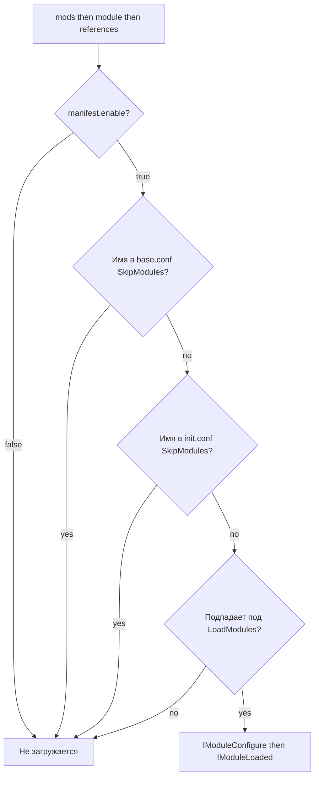

Lampac NextGen использует **Roslyn** (CSharpEval) для динамической компиляции C#-модулей при запуске. Все `.cs`-файлы из каталогов `module/` и `mods/` компилируются в памяти и подключаются как полноценные сборки ASP.NET Core. Готовые `.dll` из `references/` подключаются напрямую без компиляции.

## Порядок загрузки

<Steps>
  <Step title="mods/ — пользовательские модули">
    Сначала обрабатывается каталог `mods/`. Здесь размещаются сторонние модули, добавленные вручную.
  </Step>
  <Step title="module/ — встроенные модули">
    Затем обрабатывается `module/` со встроенными модулями, скопированными из репозитория при сборке.
  </Step>
  <Step title="references/ — готовые DLL">
    Из подкаталогов `references/` подгружаются готовые `.dll` как части MVC-приложения без компиляции.
  </Step>
  <Step title="manifest.json — Roslyn-компиляция">
    Папки с `manifest.json` на любой вложенности при необходимости компилируются Roslyn. Фильтрация по `SkipModules`, `LoadModules` и флагу `enable` в манифесте.
  </Step>
  <Step title="IModuleConfigure.Configure">
    После компиляции для каждого модуля вызывается `Configure` — регистрация контроллеров, сервисов и middleware в DI.
  </Step>
  <Step title="IModuleLoaded.Loaded">
    После старта приложения вызывается `Loaded` — инициализация фоновых задач, подписка на события.
  </Step>
  <Step title="dynamic: true — горячая пересборка">
    Модули с `"dynamic": true` в манифесте автоматически пересобираются при изменении `.cs`-файлов (`WatchersDynamicModule`).
  </Step>
</Steps>

## Как фильтры применяются вместе



## Состояние модулей

<Note>
  Не существует одного универсального «состояния по умолчанию». `config/base.conf`, starter-файл `config/example.init.conf` и `manifest.json` применяются вместе.
</Note>

### Разрешены base-конфигурацией

| Модуль | Маршруты / роль |
| --- | --- |
| Online | VOD-плагин `/online.js`, агрегатор `/lite/*` |
| SISI | 18+ `/sisi.js`, SQLite-история и закладки |
| LampaWeb | Хостинг Lampa UI, виджеты Samsung/LG, `/lampainit.js` |
| NextHUB | 18+ витрина YAML `/nexthub` |
| GStreamer | HLS/fMP4 транскодинг `/gst/*` (требует `gst.enable: true`) |
| SyncEvents | WebSocket-трансляция событий |
| Storage | Хранилище `/storage/*` |
| LampacApk | Генерация Android APK под адрес сервера |
| ProxyLimiter | Лимиты параллельных media-запросов, без отдельной страницы |

### Исключены `config/base.conf`

| Модуль | Маршруты / роль |
| --- | --- |
| Catalog | Браузер каталогов YAML `/catalog/` |
| Tracks | Субтитры и дорожки `/tracks.js`, `/ffprobe` |
| Transcoding | Legacy FFmpeg `/transcoding/` |
| WebLog | Отладка HTTP `/weblog` |
| CacheMedia | Дисковый кеш SISI-потоков |
| ForkPlayerXML | Плейлисты `/fxml` |
| MsxNative | Клиент MSX |
| Potok | Служебные маршруты `/blue-oyster/*`, `/naked-gun/*` |
| TelegramAuth | HTTP API `/tg/auth/*` |
| TelegramAuthBot | Long-polling бот привязки |

### Дополнительно исключены starter-конфигурацией

`config/example.init.conf` добавляет к исключениям:

| Модуль | Маршруты / роль |
| --- | --- |
| DLNA | DLNA/UPnP медиасервер `/dlna.js`, `/dlna/*` |
| JacRed | Агрегатор `/api/v1.0/*`, `/api/v2.0/*` |
| Sync | Plugin `/sync.js`, закладки `/bookmark/*` |
| TimeCode | Позиции `/timecode.js`, `/timecode/*` |
| TorrServer | Прокси `/ts.js`, `/ts/*` |

### Выключены через manifest.json

Среди модулей с `"enable": false`: AdminPanel, DatabaseEditor, ExternalBind, Music, Telemetry, Tg-notify.bot, Tracks, Transcoding, WatchTogether, TelegramAuth, TelegramAuthBot и LogUserRequest-Lite.

Полный актуальный каталог: [модули Lampac](/modules/overview).

## manifest.json

Каждый Roslyn-модуль содержит `manifest.json` в своей папке:

```json
{
  "enable": true,
  "dynamic": false,
  "tree": [
    "Controller.cs",
    "ModInit.cs"
  ]
}
```

| Поле | Назначение |
| --- | --- |
| `enable` | `false` — модуль не загружается даже при отсутствии в `SkipModules` |
| `dynamic` | `true` — включить горячую пересборку при изменении `.cs`-файлов |
| `tree` | Исходники и дополнительные файлы модуля |

## LoadModules и SkipModules

Оба параметра принимают одинаковые паттерны:

| Паттерн | Пример | Поведение |
| --- | --- | --- |
| Точное имя | `"MyModule"` | Конкретный модуль |
| Имя группы/папки | `"OnlineUKR"` | Все модули группы |
| Regex | `"LME.*"` | Маска по имени |
| Все | `".*"` | Загрузить/пропустить всё |

```json
{
  "BaseModule": {
    "SkipModules": ["Catalog", "DLNA", "WebLog"],
    "LoadModules": ["OnlineRUS", "OnlinePaid"]
  }
}
```

<Note>
  `LoadModules` применяется после `SkipModules`. Если модуль указан в `SkipModules` и одновременно подпадает под `LoadModules` — он **не загружается**.
</Note>

## Соглашения для пользовательских модулей

Подробный гайд по написанию собственных модулей — в разделе [Кастомные модули](/maintenance/custom-modules).

Минимальные требования:

- Публичный класс `ModInit` с реализацией `IModuleLoaded`
- `manifest.json` с `"enable": true` в папке модуля
- Конфиг через `ModuleInvoke.Init("ИмяМодуля", …)` + подписка на `EventListener.UpdateInitFile`
- Контроллеры Online/SISI наследуют от `BaseOnlineController` / `BaseSisiController`

<Warning>
  Модули Catalog, DLNA, Tracks, Transcoding, GStreamer и NextHUB не экранируют входящие запросы от сети. Включайте их только в доверенных окружениях или за WAF/firewall.
</Warning>
